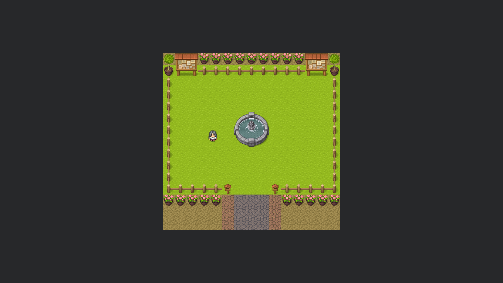

# RPG

## 💻 Projeto
Projeto baseado em um jogo rpg padrão. Permite a movimentação do personagem e limita os lugares onde é possível se locomover.

## 🧪 Tecnologias
Esse projeto foi desenvolvido com as seguintes tecnologias:

- [React](https://reactjs.org)
- [TypeScript](https://www.typescriptlang.org/)

## 📝 License

Esse projeto está sob a licença MIT. Veja o arquivo [LICENSE](LICENSE.md) para mais detalhes.
